# Start using SONATA

## General workflow

## Creating a network service with the SDK

The recommended workflow when developing a SONATA network service consists on using the CLI tools to create a workspace, create a project to hold the descriptors of the service, validate the components and finally, create a bundled service package. The required steps are as follows:

-   Step 1: Create Workspace

```
son-workspace --init
````

-   Step 2: Create Project

```
son-workspace --project project_dir
```

After this step, a sample Network Service Descriptor (NSD) and several Virtual Network Function Descriptors (VNFDs) are available at `<project_dir/sources>` directory.

-   Step 3: Edit NSD and VNFDs to compose the service

Use a text editor of choice to edit the descriptors.

-   Step 4: Validate the syntax, integrity and topology of the project

```
son-validate --project project_dir
```

-   Step 5: Create a SONATA service package

```
son-package --project project_dir -n service_package
```

After this step, if everything is correct, a package file named `service_package.son` will be created.

-   Step 6: Onboard the package into the SONATA Service Platform or Emulator

```
son-access push --upload service_package.son
```

These are the most basic steps to develop a network service, however additional features may be used and configuration procedures may take place, when required. For instance, to compose a NSDs and VNFDs, the son-editor GUI may be used. Likewise, the son-validator GUI can also be used to trigger validations and visualize the resulting errors, the service network topology, the forwarding graphs, etc. Regarding configuration procedures, before step 6 takes place (onboard a network service to the service platform) the service platform URL and user credentials must be configured in the workspace. To learn more about the additional features and configuration requirements please consult the wiki \[documentation\](https://github.com/sonata-nfv/son-cli/wiki) of son-cli repository.

## Testing a network service with the EMULATOR

To deploy and test a network service on the emulation platform you can use the son-cli tools just like you would do when pushing a service to the service platform. You can find an example service package and a detailed description of the workflow [online]. The main steps are as follows:

-   Step 1: Start the emulator
    -   `sudo python ~/demo/topologies/son-emu_example3.py`
-   Step 2: Create a SONATA service package using son-cli
    -   `son-package --project demo/sonata-demo-service -n sonata-demo-service`
-   Step 3: Deploy the created service package on the emulator
    -   `son-access push --upload sonata-demo-service.son`
-   Step 4: Instantiate the service
    -   `son-access push --deploy `<insert service uuid from last step here>
-   Step 5: Check the running SONATA service
    -   `son-emu-cli compute list`

The output will show you the running VNFs of the service and the emulated datacenters:

<!--
```
+--------------+-------------+--------------------------------+-------------------+-------------------------------------+
| Datacenter   | Container   | Image                          | Interface list    | Datacenter interfaces               |
+==============+=============+================================+===================+=====================================+
| dc2          | snort_vnf   | sonatanfv/sonata-snort-ids-vnf | mgmt,input,output | dc2.s1-eth2,dc2.s1-eth3,dc2.s1-eth4 |
+--------------+-------------+--------------------------------+-------------------+-------------------------------------+
| dc1          | client      | sonatanfv/sonata-iperf3-vnf    | client-eth0       | dc1.s1-eth2                         |
+--------------+-------------+--------------------------------+-------------------+-------------------------------------+
| dc1          | server      | sonatanfv/sonata-iperf3-vnf    | server-eth0       | dc1.s1-eth3                         |
+--------------+-------------+--------------------------------+-------------------+-------------------------------------+
```
-->


| Datacenter   | Container   | Image                          | Interface list    | Datacenter interfaces               |
|--------------|-------------|--------------------------------|-------------------|-------------------------------------|
| dc2          | snort_vnf   | sonatanfv/sonata-snort-ids-vnf | mgmt,input,output | dc2.s1-eth2,dc2.s1-eth3,dc2.s1-eth4 |
| dc1          | client      | sonatanfv/sonata-iperf3-vnf    | client-eth0       | dc1.s1-eth2                         |
| dc1          | server      | sonatanfv/sonata-iperf3-vnf    | server-eth0       | dc1.s1-eth3                         |


  [online]: https://github.com/sonata-nfv/son-tutorials/tree/master/upb-containernet-emulator-summerschool-demo
  
### Monitoring a network service with the son-monitor

To monitor a service running under `son-emulator`, `son-monitor` requires a Monitor Service Descriptor (`msd`). It describes which metrics to gather on the specified VNFs. A detailed explanation on building a `msd` can be found [here]. For this quick guide, the following `msd` can be used:

```yaml
service_name: "sonata-demo-service"
version: "0.1"
author: "SONATA"
description: "Monitor descriptor example for the quick use guide"
dashboard: "son-demo-service"
vnf_metrics:
  - metric_type: "cpu"
    description: "cpu load (%)"
    vnf_ids:
      - vnf: "snort_vnf" 
nsd_links:
  - metric_type: "packet_count"
    description: "packet_count of links"
    link_ids:
      - description: "example tx traffic"
        link_id: "link-12"
        source: "client:client-eth0"
        destination: "snort_vnf:input"
        direction: "tx"
      - description: "example rx traffic"
        link_id: "link-32"
        source: "snort_vnf:output"
        destination: "server:server-eth0"
        direction: "rx"
```

-   Step 1: after creating the topology, `son-monitor` is started with:

```
son-monitor init start
```

-   Step 2: the metrics are gathered by submitting the previous `msd` file:

```
son-monitor msd -f sonata_demo_service.yml start
```

-   Step 3: browse the `son-monitor` [dashboard]
-   Step 4 (optional): to stop the gathering of metrics:

```
son-monitor msd -f sonata_demo_service.yml stop
```

-   Step 5 (optional): to stop `son-monitor`:

```
son-monitor init stop
```

[The `son-monitor` wiki pages][here] contain more information on how to use this tool.

### Analysing a network service with the son-analyze

The metrics generated by a running service can be analysed using `son-analyze`. This tool will bring a service's metrics inside an environment where the developer can further analyse them.

-   Step 1: first `son-analyze` need to be bootstrapped:

```
son-analyze bootstrap
```

-   Step 2: to start a `son-analyze` environment:

```
son-analyze run
```

-   Step 3: start browsing the displaying link. The environment will keep running as long as the previous is keep alive

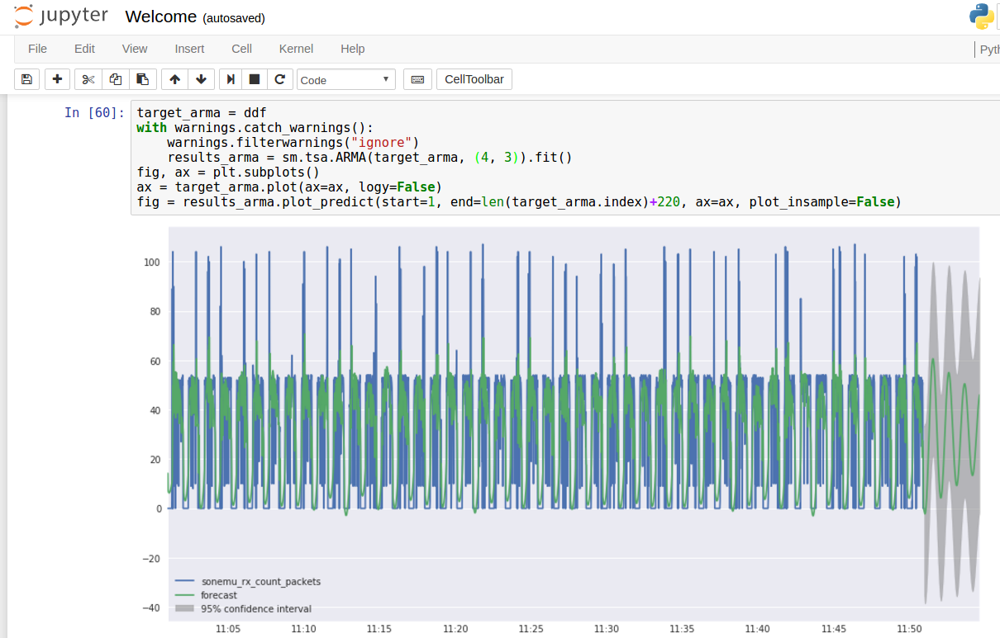


Further information can be found [in the `son-analyze` wiki pages].

  [here]: https://github.com/sonata-nfv/son-cli/wiki/SONATA-Monitor:-Monitor-service-descriptor
  [dashboard]: http://localhost:3000
  [in the `son-analyze` wiki pages]: https://github.com/sonata-nfv/son-analyze/wiki

  [online]: https://github.com/sonata-nfv/son-tutorials/tree/master/upb-containernet-emula


## Deploying a service with the SERVICE PLATFORM

### Login to SONATA Service Platform

-   Step 1: Fill the login form with your username and password and press the “Login” button:

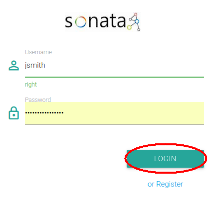

-   Step 2: After the authorization check you will be redirected to GUI's main dashboard:

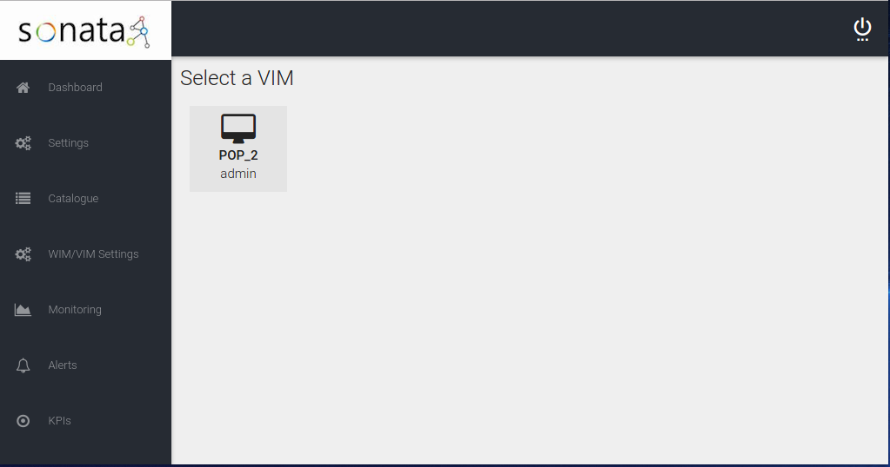

### Add a new VIM/WIM

-   Step 1: Select “WIM/VIM Settings” from the main menu.

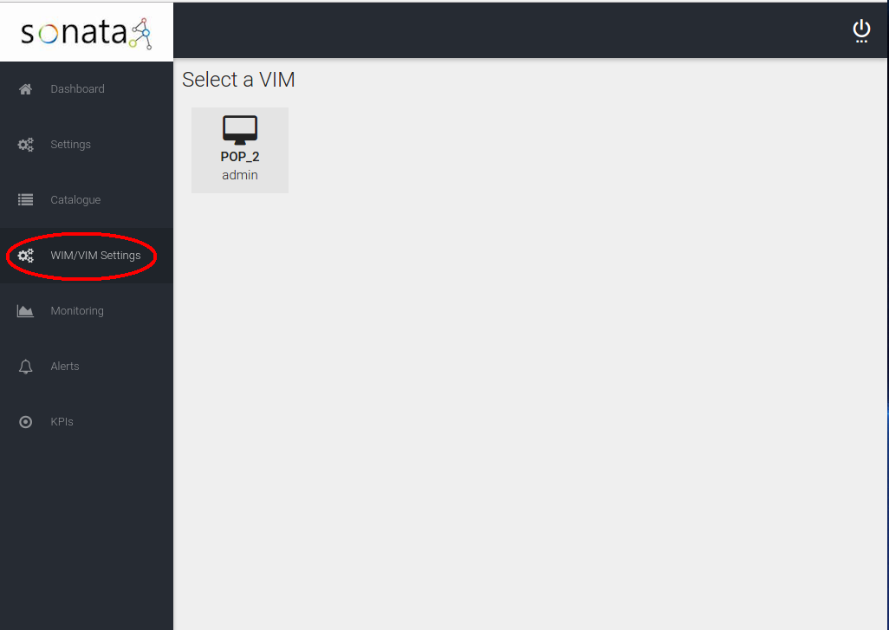

-   Step 2: Select “Add WIM” button.

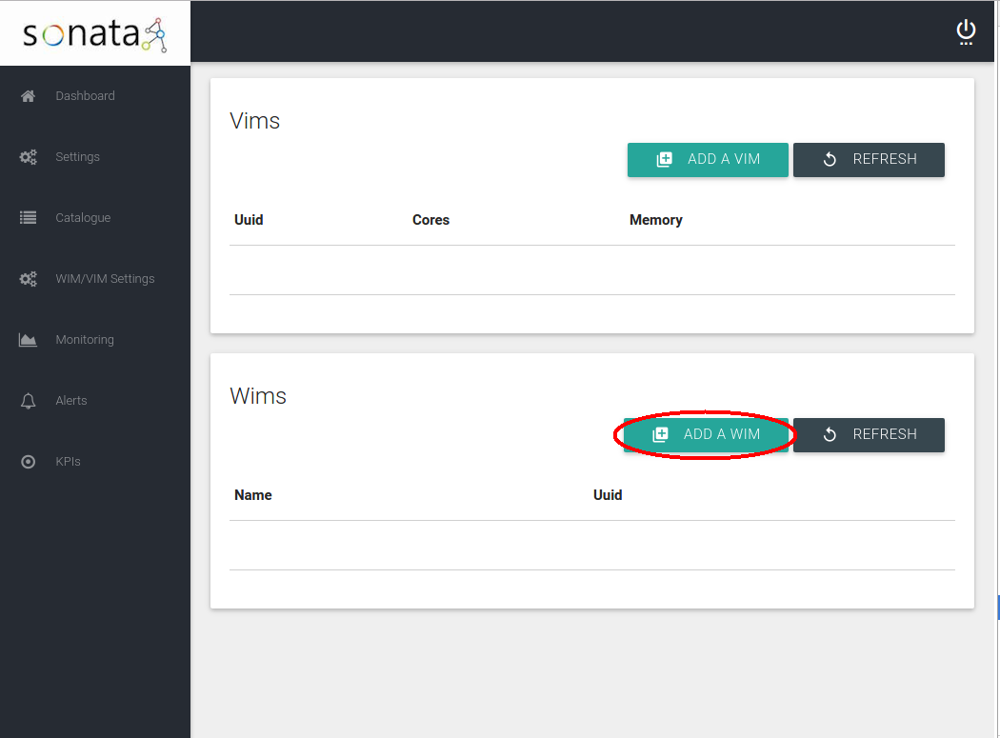

-   Step 3: Fill all the fields of the “New WIM” form and press “Save”.

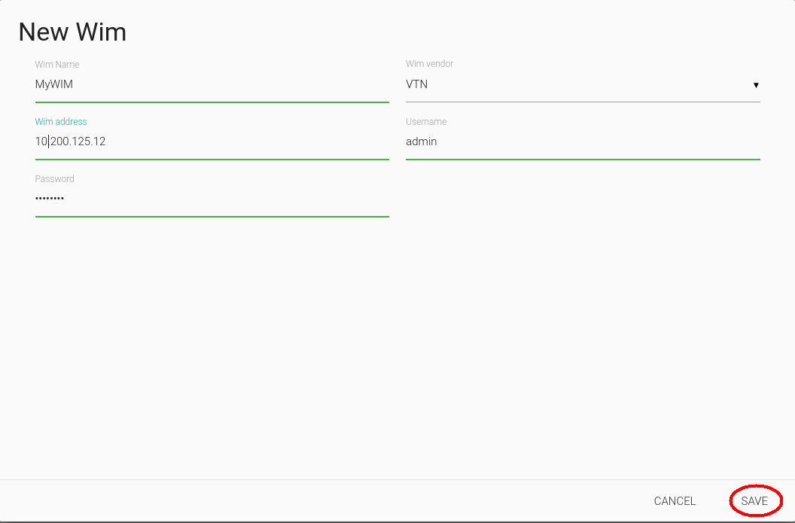

-   Step 4: Select “Add VIM” button.

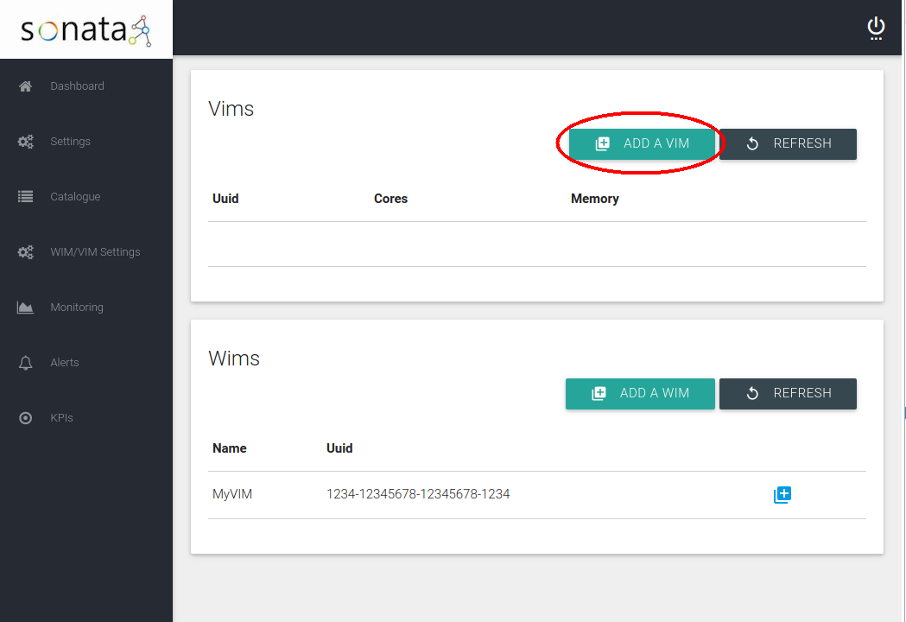

-   Step 5: Fill all the fields of the “New VIM” form and press “Save”.

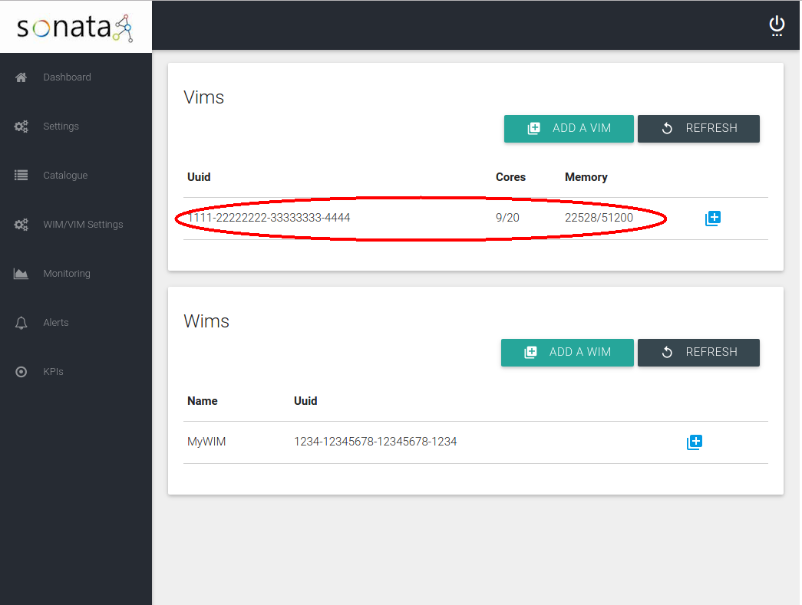

### Package on boarding

Package on-boarding in SONATA consists of a sequence of steps, performed before the package is stored in the platform's Catalogues. These steps guarantee that only valid packages are made available to the platform owner's customers. That sequence of steps are the following:

1.  **Authenticate the developer submitting the package:** the openness demanded for the 5G era of Service Platforms do not necessarily imply anonymity. Knowing who its users are support not only security but also some still unforeseen and arbitrarily complex business models between the different stakeholders;
2.  **Authorize the developer submitting the package:** with the expected network-based relationships between all the stakeholders, access and usage restrictions can naturally be needed, which demands a flexible but strong authorization set of mechanisms to be in place;
3.  **Validating the submitted package:** packages, services and functions have to follow a predefined schema, enabling fully automatic processes to be put in place to orchestrate the service dependent instantiation. Package signing, if present, can also be verified in this phase of the on-boarding process. Furthermore, semantic and logical verifications can be made, e.g., to alert to invalid specified flows of traffic;
4.  **Submission for storage:** valid packages have to be stored, both as the whole file and a set of meta-data that can later be used by the MANO Framework when a service instantiation, update or termination is requested, without having to open and extract that information from the whole package again.

With this last step concluded successfully, the service remains ready to be instantiated by any customer of the SP owner (see the following sub-section).


### Login to SONATA Service Platform BSS

-   Step 1: Fill the login form with your username and password and press the “Login” button:

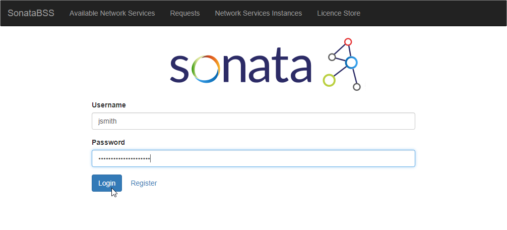

-   Step 2: After the authorization check you will be redirected to BSS's Available Network Services section:

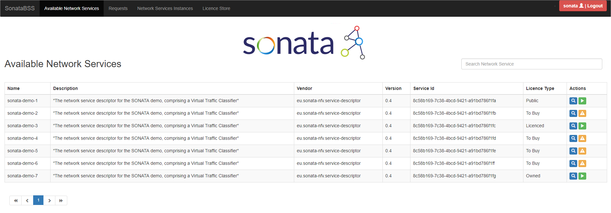


### Instance a hello-world Network Service from BSS

-   Step 1: Login and verify that the selected section is “Available Network Services”.

```
(In order to proceed with the network service instantiation, it's necessary the service catalogue contains at least one service)
```


-   Step 2: Select the “Instantiate” button.

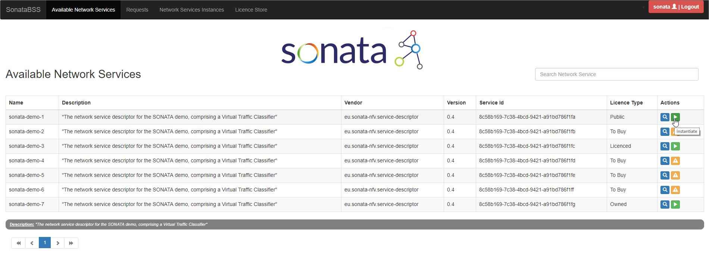

-   Step 3: Ingress and Egress fields can be filled to configure the network service at the infrastructure level (optional). Confirm the instantiation request pressing the “Yes” button.

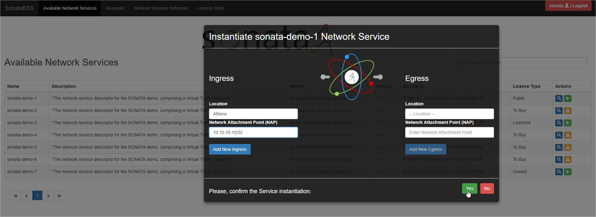

-   Step 4: A message with the request id is displayed.

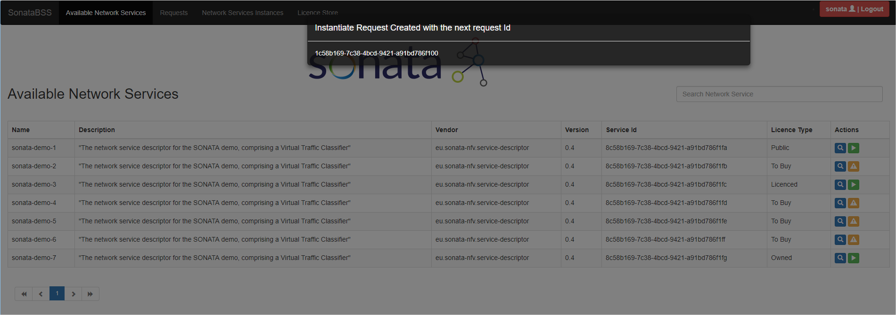

-   Step 5: Check that the request is listed in the “Requests” section.

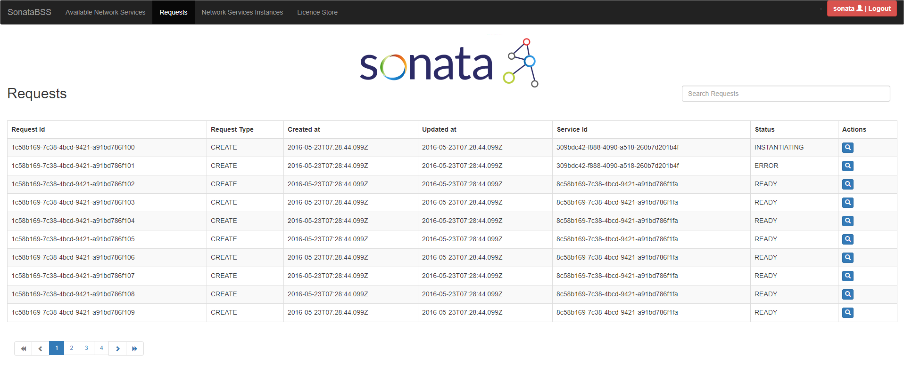


### Monitoring a function

#### Install monitoring Probe

The easiest way to deploy monitoring probe is as Docker container but it can be installed also as a service.

-   Step 1: Build container

```
git clone https://github.com/sonata-nfv/son-monitor-probe.git
cd son-monitor-probe
sudo docker build -f vm_mon/Dockerfile -t son-vm-probe .
```

Alternately, you can pull the latest image from Sonata's repository in Docker Hub

```
sudo docker pull sonatanfv/son-monitor-probe:latest
```

-   Step 2: Run probe

```
sudo docker run -d --name son-vm-probe -e NODE_NAME=VNF_1 -e PROM_SRV=http://<service_platform_ip>:9091/metrics --net="host" --privileged=true  -v /proc:/myhost/proc -v /:/rootfs:ro son-vm-probe
```

More details about installation alternatives can be found in [GitHub wiki].

#### Retrieve monitoring data from GUI

GUI provides monitoring data related to the components comprising the Sonata service platform and also the deployed VNFs. This information is organized in two views (named 'Service platform' and 'VNFs' ) under the Monitoring menu. Developers can access to monitoring data that are related with the VNFs of their NS using GUI.

-   Step 1: Login in GUI

see [Login](#login-to-sonata-service-platform)

-   Step 2: Select “Monitoring-&gt;VNFs” from the menu.

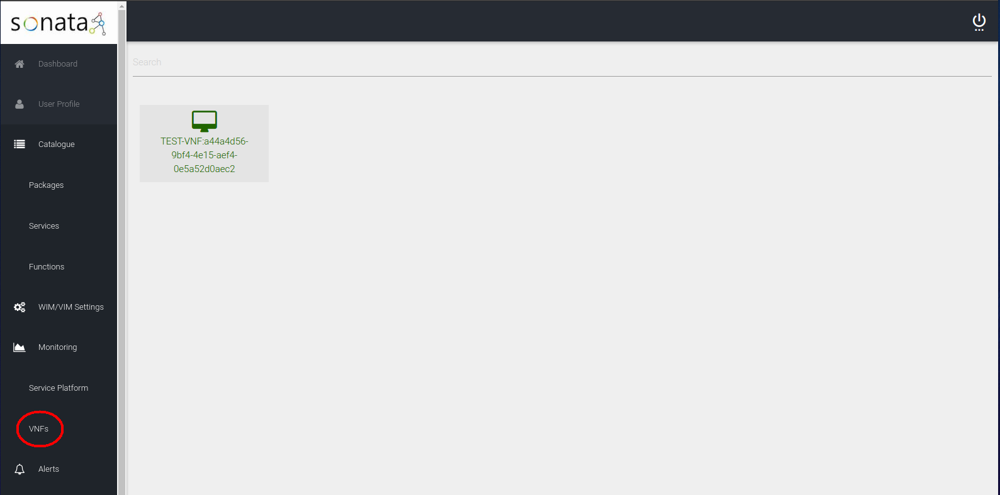

-   Step 3: Select one of the deployed VNFs in order to view charts of the monitoring data.

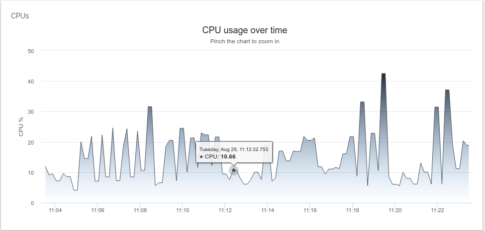

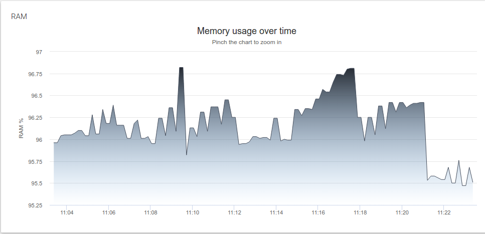

  [`https://github.com/sonata-nfv/son-monitor-probe.git`]: https://github.com/sonata-nfv/son-monitor-probe.git
  [`http://`]: http://
  [GitHub wiki]: https://github.com/sonata-nfv/son-monitor-probe/wiki/VNF-monitoring
