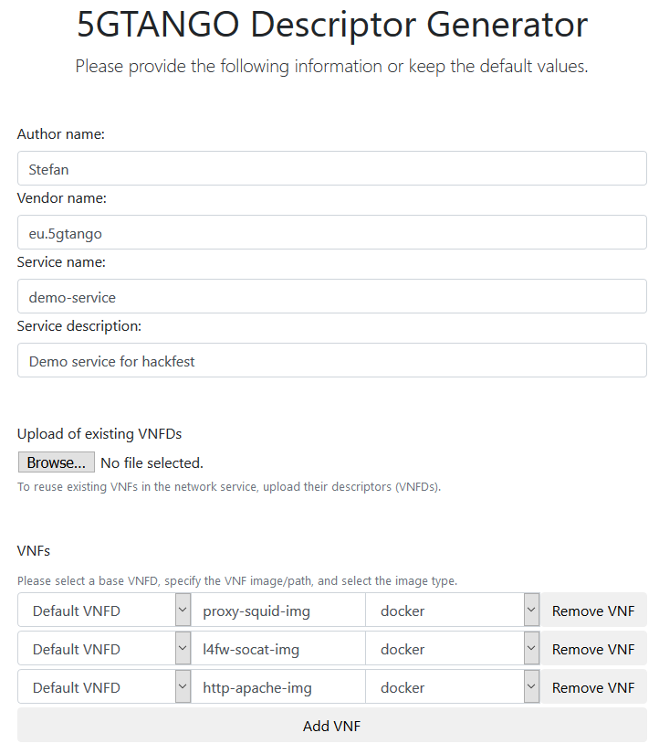

# 5GTANGO SDK Demo

This demo shows the 5GTANGO SDK, including the full workflow of descriptor generation, project management, validation, packaging, and on-boarding and instantiation on the *vim-emu* emulator.

This demo is based on a [demo previously presented at IEEE NFV-SDN 2018](https://github.com/CN-UPB/demo-multi-platform-nfv-sdk).

**Contact information:**
Stefan Schneider (@[stefanbschneider](https://github.com/stefanbschneider))
Paderborn University

## Setup

To run the full demo, including instantiation of the service on the emulator, you should use Ubuntu 16.04. All previous steps of the demo also work on other operating systems (eg, Windows and Mac OS).

See the [getting started guide](https://sonata-nfv.github.io/sdk-installation) to install the project management, validation, and packaging tool in a Python 3.5+ virtual environment:

```bash
# install
pip install git+https://github.com/sonata-nfv/tng-sdk-project.git
pip3 install git+https://github.com/sonata-nfv/tng-sdk-validation.git
pip3 install git+https://github.com/sonata-nfv/tng-sdk-package

# test
tng-project -h
tng-validate -h
tng-package -h
```

For the last part of the demo, you will also need the *vim-emu* prototyping platform. Follow the install instructions for the [bare-metal installation](https://osm.etsi.org/wikipub/index.php/VIM_emulator#Option_1:_Bare-metal_installation):

```bash
# package requirements
sudo apt-get install ansible git aptitude

# containernet
git clone https://github.com/containernet/containernet.git
cd ~/containernet/ansible
sudo ansible-playbook -i "localhost," -c local install.yml

# vim-emu
git clone https://osm.etsi.org/gerrit/osm/vim-emu.git
cd ~/vim-emu/ansible
sudo ansible-playbook -i "localhost," -c local install.yml
```

## Demo walkthrough

### Descriptor generation

To use the graphical descriptor generation, navigate to https://sonata-nfv.github.io/tng-sdk-descriptorgen/ and default values for author, service, and description (keep in mind that vendor and service need to be lowercase strings without spaces).

Finally add VNFs with the following Docker images (in this order!):

* `proxy-squid-img`
* `l4fw-socat-img`
* `http-apache-img`



**TODO:** continue here

### Package management

### Validation

### Packaging

### Emulation

